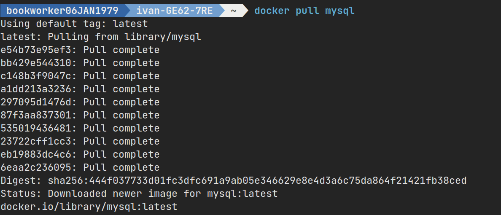
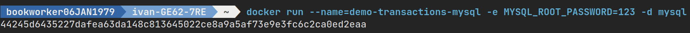
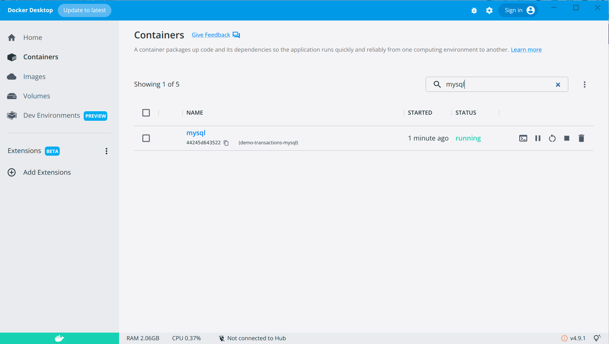
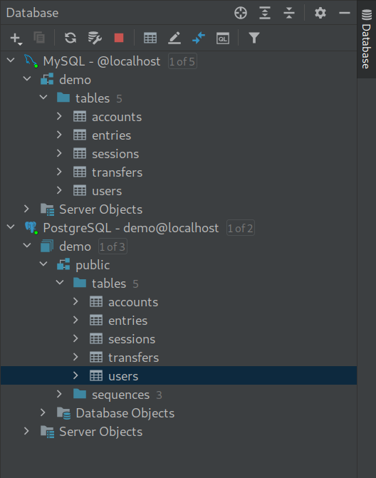

Подготовка базы demo MySQL
==========================

.. _Официальный сайт MySQL: https://www.mysql.com/
.. _MySQL Docker образ: https://hub.docker.com/_/mysql

`Официальный сайт MySQL`_, `MySQL Docker образ`_.

Как это вообще делается

.. code-block:: bash
  :linenos:

      $ docker pull mysql
      $ docker run --name=demo-transactions-mysql -e MYSQL_ROOT_PASSWORD=123 -d mysql

Но я написал удобный Makefile см /code/build/mysql/Makefile

Нужно будет выполнить ``make first-run`` и читать лог в Docker Desktop что-бы дождаться когда
сервер БД успешно запустится. для MySQL это занимает 10-15 секунд на моем ноутбуке.
Затем выполнить ``make create-db``

.. code-block:: bash
  :linenos:

      $ make first-run
      $ make create-db

После этого я настроил подключение к базе в IDE, вот что получилось:

