Уровни Изоляции Транзакций в MySQL
==================================

Получить текущий уровень изоляции в MySQL
-----------------------------------------

Чтобы получить уровень изоляции транзакций текущего сеанса, мы можем запустить

.. code-block:: sql
  :linenos:

    select @@transaction_isolation;

По умолчанию это **repeatable read**.
Этот уровень применяется только к этому конкретному сеансу консоли MySQL.

Существует также глобальный уровень изоляции,
который применяется ко всем сеансам при их первом запуске.
Мы можем получить его значение, добавив global к предыдущему запросу на выборку.

.. code-block:: sql
  :linenos:

    select @@global.transaction_isolation;

По умолчанию тоже **repeatable read**.

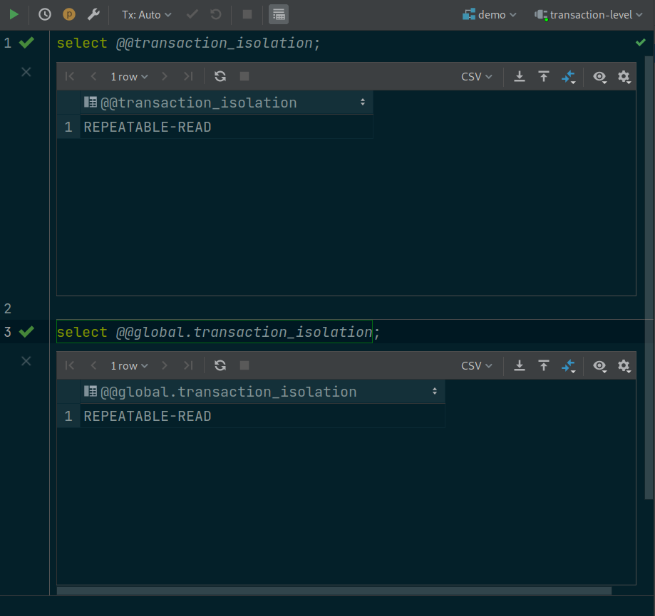

Изменить уровень изоляции в MySQL
---------------------------------

Теперь, чтобы изменить уровень изоляции текущего сеанса,
мы можем использовать этот запрос:

.. code-block:: sql
  :linenos:

    set session transaction isolation level read uncommitted;

Вы можете заменить **read uncommitted**
именем уровня изоляции, который вы хотите установить.

После этого, если мы снова запустим select,
мы увидим, что она была изменена на **read uncommitted**.

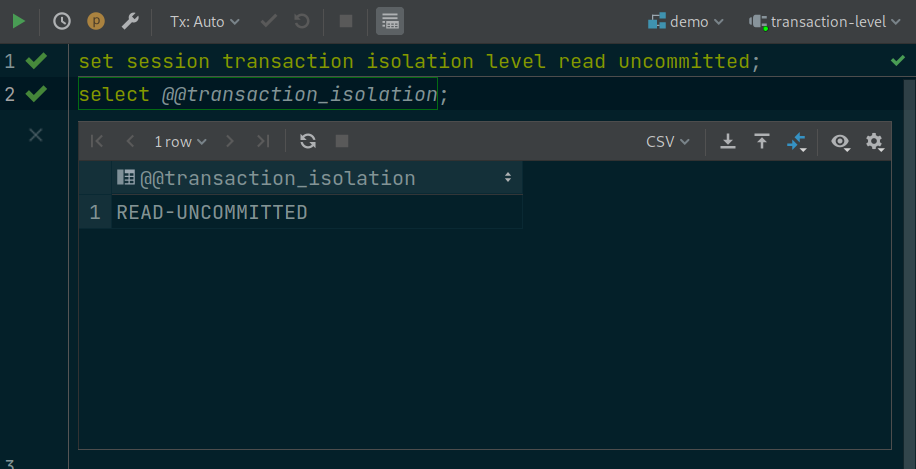

.. warning::
    **Обратите внимание**,
    что это изменение повлияет только
    на все будущие транзакции этого текущего сеанса,
    но не на транзакции,
    которые выполняются в другом сеансе консоли MySQL.

Чтение незафиксированного уровня изоляции в MySQL
-------------------------------------------------

Dirty Read
~~~~~~~~~~

Хорошо, теперь, чтобы продемонстрировать взаимодействие
между двумя одновременными транзакциями,
я открою другое окно терминала,
поставлю его рядом с этим и запущу внутри него новую консоль MySQL.
Затем давайте также установим уровень изоляции этого сеанса read uncommitted.

Хорошо, теперь оба сеанса работают на **read uncommitted** уровне изоляции.
Теперь мы можем начать новую транзакцию.

В MySQL мы можем либо использовать **start transaction**
оператор, либо просто использовать **begin**
оператор в качестве альтернативы.

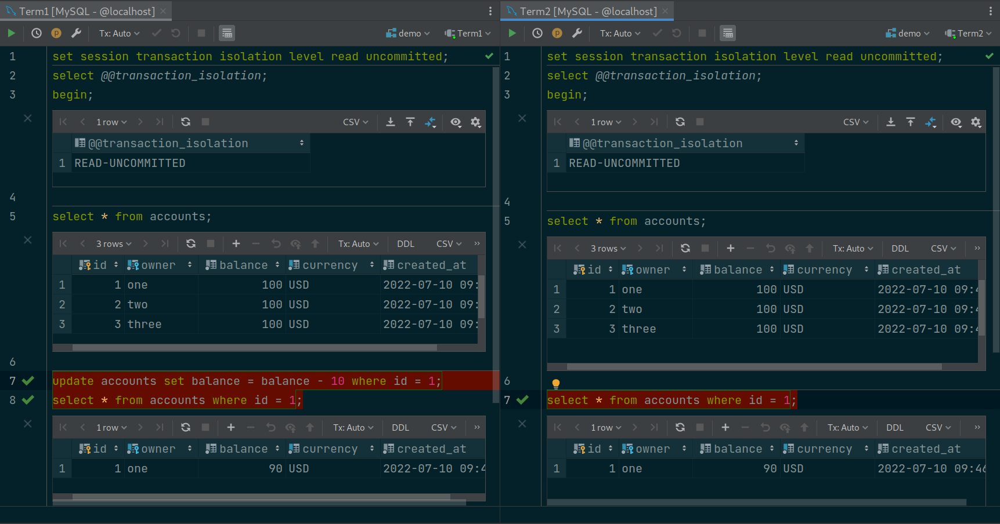

Запустим все в следующей последовательности
Откроем два терминала Term1, Term2

Выполним строки 1,2,3 в Term1 затем в Term2
* это установка уровня и начало транзакции

Выполним строки 4,5 в Term1 затем в Term2
* здесь мы смотрим какие данный видны в каждой транзакции

Выполним строки 7,8 в Term1 затем в Term2
* 7-ая строка изменяет данные в транзакции 1
* 8-ая строка читает данные которые видны транзакции

В результате мы увидим **Грязное Чтение**.
Одна транзакция видит незакомиченные изменения другой транзакции.
Т.е. мы первую транзакцию в которой изменили данные еще не закомитили
а вторая транзакция уже видит изменения.
Это и называется **Dirty Read**

Чтение зафиксированного уровня изоляции в MySQL
-----------------------------------------------

Non-Repeatable и Phantom Read
~~~~~~~~~~~~~~~~~~~~~~~~~~~~~

Начинаем снова но уровень изоляции увеличим
Снова откроем два терминала.
Оба сеанса будут работать на **read committed** уровне изоляции.
Начинаем новую транзакцию.

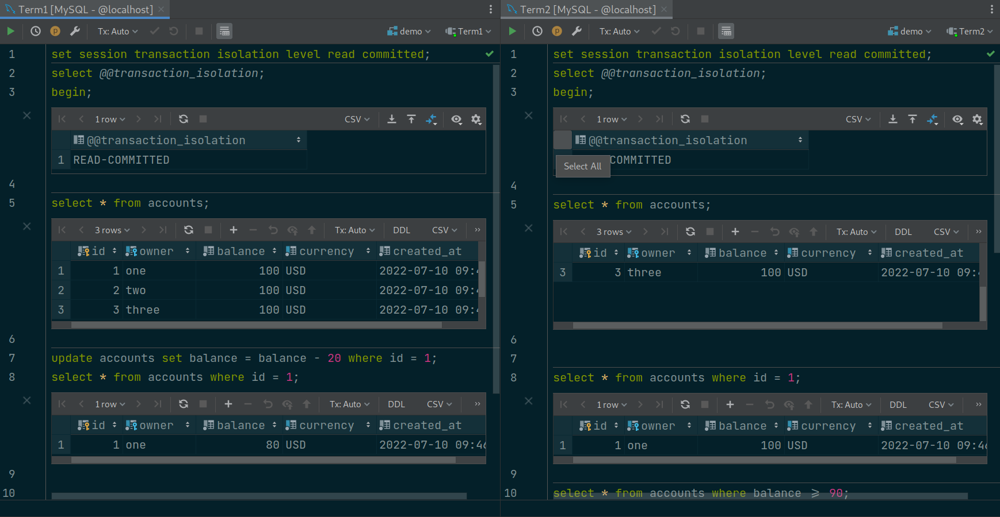

Запустим все в следующей последовательности
Откроем два терминала Term1, Term2

Выполним строки 1,2,3 в Term1 затем в Term2
* это установка уровня и начало транзакции

Выполним строки 4,5 в Term1 затем в Term2
* здесь мы смотрим какие данный видны в каждой транзакции

Выполним строки 7,8 в Term1 затем в Term2
* 7-ая строка изменяет данные в транзакции 1
* 8-ая строка читает данные которые видны транзакции

На этом шаге мы видим что **dirty read** отсутствует
Вторая транзакция не видит изменений сделанных первой транзакцией.

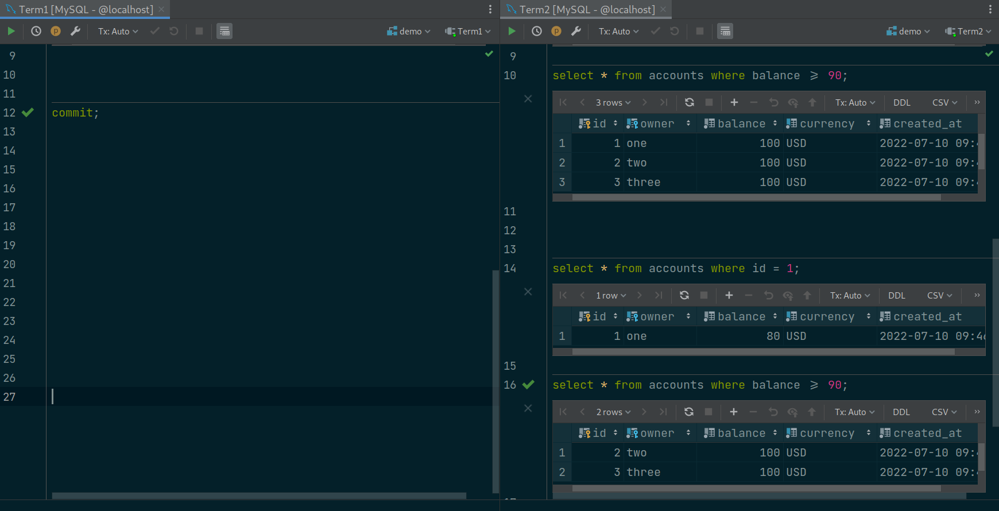

Выполним строку 10 в Term2
* здесь мы получаем Набор строк удовлетворяющий определенным условиям
и мы видим что в наборе возвращается 3 строки не учитывающие изменения первой транзакции.

Выполним строку 12 в Term1
* мы закомитили изменения в первой транзакции. транзакция 1 завершилась.
Но вторая транзакция все еще не закрыта.

Выполним строку 14 в Term2
* мы видим что вторая транзакция увидела изменения сделанные первой транзакцией.
такой же запрос мы выполнили на строке 8 и это было ДО того как закрылась первая транзакция
и получается что в течении транзакции один и тот же запрос вернул разные данные.
Это и называется **non-repeatable read**

Выполним строку 16 в Term2
* такой же запрос мы выполняли на строке 10 и это было ДО того как закрылась первая транзакция
в первый раз мы получили 3 строки, а теперь когда первая транзакция завершилась 2 строки
это и называется **phantom-read**

Итак, теперь мы знаем, что **read committed** уровень изоляции
может только предотвращать **dirty read**,
но все же разрешать явления **non-repeatable read**, **phantom read**.

Повторяемый уровень изоляции чтения в MySQL
-------------------------------------------

Теперь я собираюсь установить уровень изоляции транзакций
обеих сессий на **repeatable read**.
И начать 2 новых транзакции.

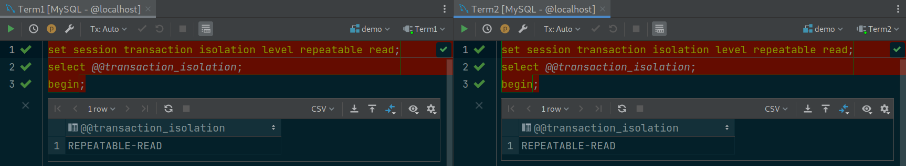

Теперь давайте выберем все учетные записи в transaction 1.
Затем выберите учетную запись с идентификатором 1 в transaction 2.
Также выберите все счета с балансом не менее 80 долларов.
Так мы проверим, происходит ли фантомное чтение или нет.

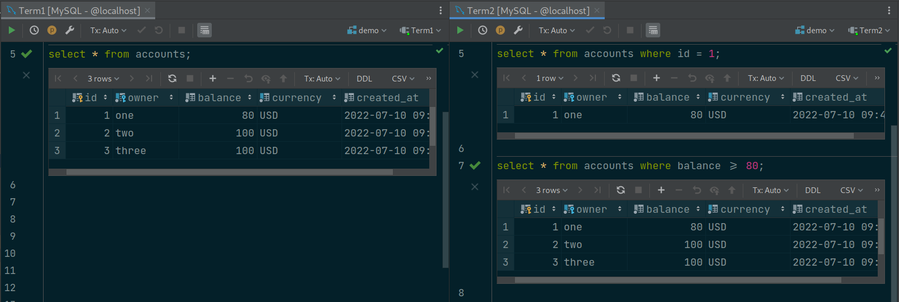

Хорошо, теперь вернитесь transaction 1
и вычтите 10 из его баланса.

.. code-block:: sql
  :linenos:

    update accounts set balance = balance - 10 where id = 1;

Затем прочитайте все записи в transaction 1.

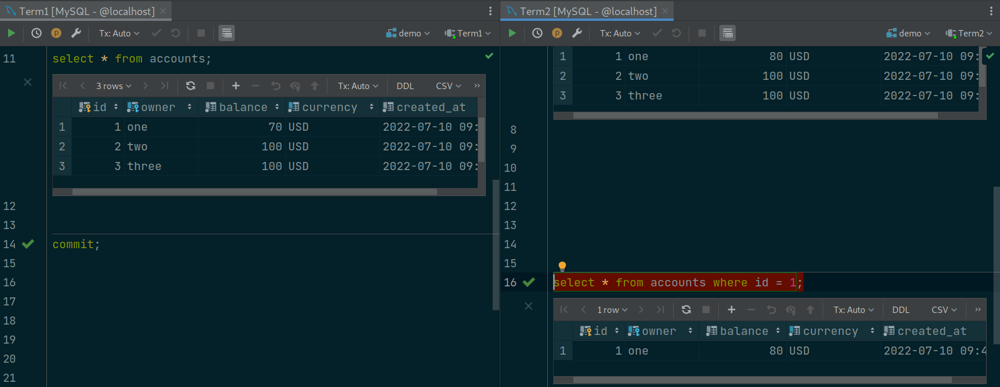

Теперь мы видим, что баланс счета 1 уменьшился до 70 долларов.

Мы знаем, что грязное чтение уже остановлено
на более низком уровне изоляции:
чтение зафиксировано.

Поэтому нам не нужно проверять это
на этом уровне из-за этого правила:

.. warning::
    Любые явления, которые были предотвращены
    на более низком уровне изоляции,
    не будут иметь возможности
    произойти на более высоком уровне.

Итак, давайте зафиксируем эту транзакцию 1,
а затем перейдем к транзакции 2, чтобы посмотреть,
сможет ли она прочитать новые изменения,
сделанные транзакцией 1, или нет.

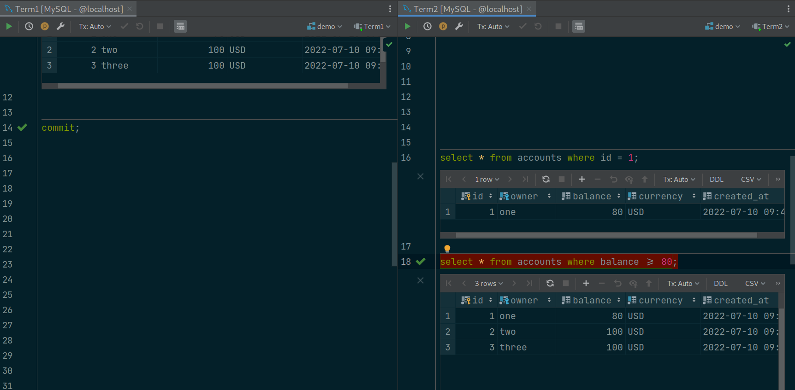

Теперь этот запрос на выборку возвращает старую версию
аккаунта 1 с балансом в 80 долларов,
хотя транзакция 1 изменила его на 70
и была успешно зафиксирована.

Это связано с тем, что **repeatable-read**
уровень изоляции гарантирует,
что все запросы на чтение повторяемы,
а это означает, что он всегда возвращает
один и тот же результат,
даже если есть изменения,
внесенные другими зафиксированными транзакциями.

Сказав это, давайте повторно запустим запрос,
чтобы выбрать аккаунты с минимум 80 долларами:

Как видите, он по-прежнему возвращает
те же 3 записи, что и раньше.
Таким образом **phantom read**,
явление также предотвращается
на этом repeatable-read уровне изоляции.
Замечательно!

Однако мне интересно, что произойдет,
если мы также запустим запрос на обновление,
чтобы вычесть 10 из баланса учетной записи 1
в transaction 2?
Изменится ли баланс на 70, 60 или выдаст ошибку?
Давай попробуем!

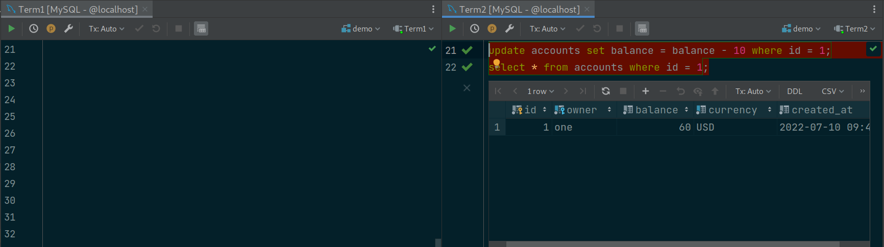

Ошибки нет, и баланс учетной записи теперь составляет 60 долларов США,
что является правильным значением,
поскольку transaction 1 ранее
уже было зафиксировано изменение,
изменившее баланс на 70 долларов.

Однако с этой transaction 2 точки зрения это не имеет смысла,
потому что в последнем запросе на выборку
он увидел баланс в 80 долларов,
но после вычитания 10 долларов со счета
теперь он получает 60 долларов.
Математика здесь не работает,
потому что на эту транзакцию все еще влияют
параллельные обновления от других транзакций.

Я не знаю, почему MySQL решает реализовать **repeatable read**
уровень изоляции таким образом,
но было бы разумнее просто отказаться от изменения,
вызвав в этом случае ошибку,
чтобы обеспечить согласованность данных транзакции.
Позже мы увидим, что именно так Postgres обрабатывает
одновременные обновления этого типа на этом уровне изоляции.

А пока давайте просто откатим эту транзакцию

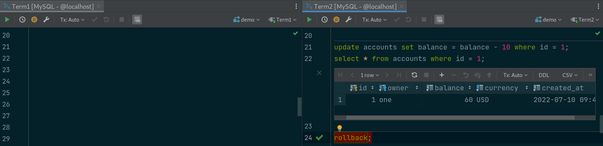

и попробуем перейти на самый высокий уровень изоляции,
чтобы посмотреть, можно ли предотвратить эту проблему или нет.
