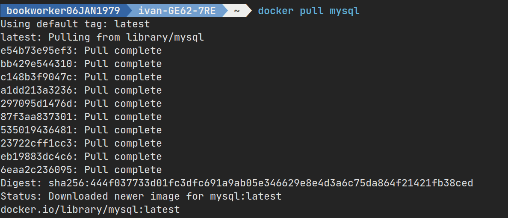
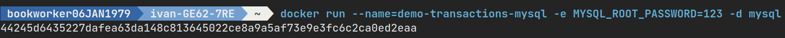
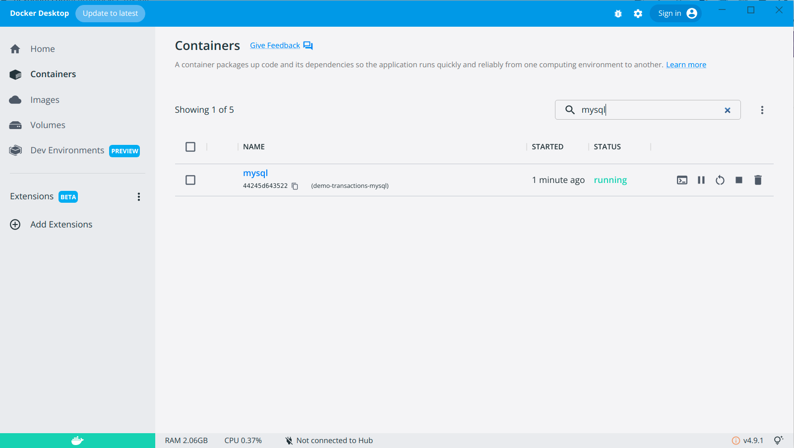

Уровни Изоляции Транзакций в MySQL
==================================

.. _Официальный сайт MySQL: https://www.mysql.com/
.. _MySQL Docker образ: https://hub.docker.com/_/mysql

`Официальный сайт MySQL`_, `MySQL Docker образ`_.

Как это вообще делается

.. code-block:: bash
  :linenos:

      $ docker pull mysql
      $ docker run --name=demo-transactions-mysql -e MYSQL_ROOT_PASSWORD=123 -d mysql

Но я написал удобный Makefile см /code/build/mysql/Makefile