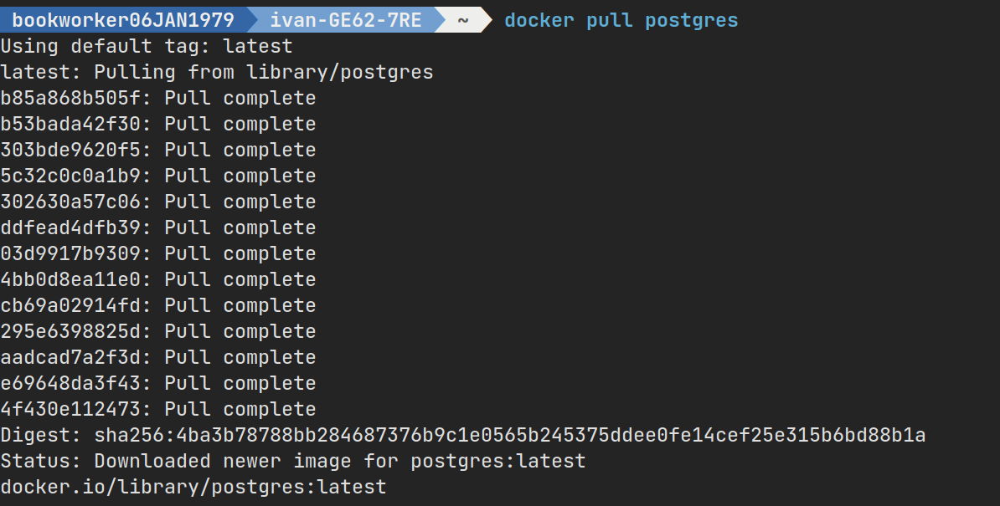
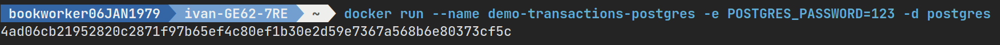
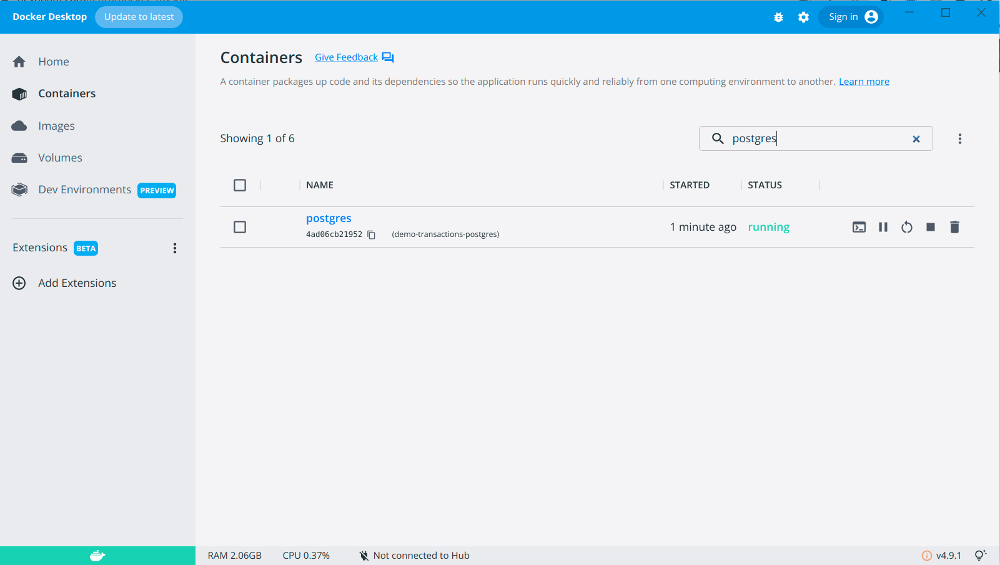

Уровни Изоляции Транзакций в PostgreSQL
=======================================

.. _Официальный сайт PostgreSQL: https://www.postgresql.org/
.. _PostgreSQL Docker образ: https://hub.docker.com/_/postgres

`Официальный сайт PostgreSQL`_, `PostgreSQL Docker образ`_.

Как это вообще делается

.. code-block:: bash
  :linenos:

      $ docker pull postgres
      $ docker run --name demo-transactions-postgres -e POSTGRES_PASSWORD=123 -d postgres

Но я написал удобный Makefile см /code/build/mysql/Makefile