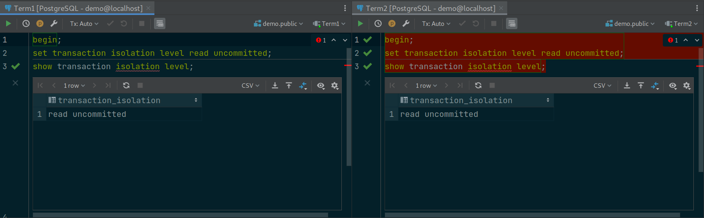
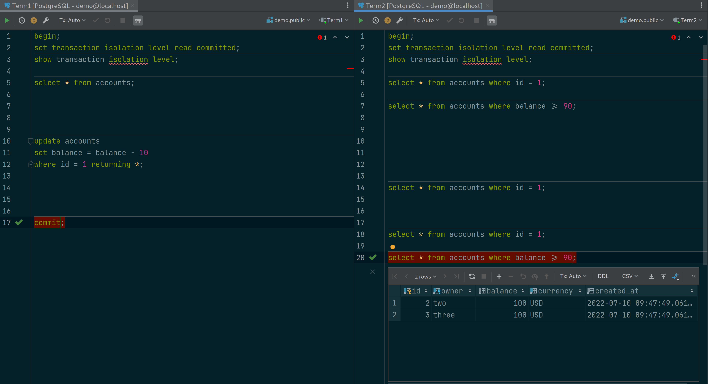

Уровни Изоляции Транзакций в PostgreSQL
=======================================

Во-первых, давайте запустим 2 консоли SQL PostgreSQL.

Получить текущий уровень изоляции в Postgres
--------------------------------------------

В postgres для получения текущего уровня изоляции запускаем такую команду:

.. code-block:: sql
  :linenos:

        show transaction isolation level;

По умолчанию это read committed.
Таким образом, на 1 уровень выше, чем уровень изоляции по умолчанию в MySQL.

Изменить уровень изоляции в Postgres
------------------------------------

То, как мы меняем уровень изоляции,
также отличается.

В MySQL мы устанавливаем уровень изоляции
всей сессии соединения с бд перед запуском транзакций.

Но в Postgres мы можем установить уровень изоляции только внутри транзакции,
и это повлияет только на эту 1 конкретную транзакцию.

Итак, давайте начнем transaction 1
и установим уровень изоляции read uncommitted.

Чтение незафиксированного уровня изоляции в Postgres
----------------------------------------------------

В transaction 1 давайте выберем все аккаунты.

На данный момент есть 3 аккаунта с одинаковым балансом 100 долларов.
В transaction 2 давайте выберем только учетную запись с идентификатором 1.

.. image:: ../../img/postgresql/005-read-uncommitted-2.png
  :width: 1723
  :alt: postgresql - read uncommitted part 1

Затем вернитесь transaction 1 и обновите его баланс.
Баланс счета 1 здесь изменен на 90 долларов.
Теперь мы снова выбираем эту учетную запись в transaction 2:

Странно, это все еще 100 долларов!
Это неожиданно, потому что мы используем read-uncommitted уровень,
поэтому в transaction 2 мы должны видеть незафиксированные данные transaction 1,
верно?

Но, на самом деле, если мы посмотрим документацию Postgres,
то увидим, что read uncommitted Postgres ведет себя точно так же,
как и read committed.

Таким образом, мы можем сказать,
что у Postgres есть только 3 уровня изоляции,
и самый низкий уровень — это read committed.
Это имеет смысл, потому что обычно мы никогда не хотели бы использовать read uncommitted
ни при каких обстоятельствах.

Итак, давайте продолжим и зафиксируем transaction 1.
Затем выберите учетную запись 1 transaction 2 еще раз.

.. image:: ../../img/postgresql/007-read-uncommitted-4.png
  :width: 1723
  :alt: postgresql - read uncommitted part 3

Теперь он видит подтвержденный баланс: 90 долларов, как и ожидалось.
Хорошо, давайте зафиксируем эту транзакцию
и перейдем на следующий уровень изоляции.

Чтение зафиксированного уровня изоляции в Postgres
--------------------------------------------------

Я собираюсь начать 2 новые транзакции
и установить их уровень изоляции **read committed**:

Теперь, как и раньше, давайте выберем все учетные записи в transaction 1,
а затем выберем только учетную запись 1 в transaction 2.

Помимо феномена грязного чтения, мы также хотим посмотреть,
как он справляется с фантомным чтением,
поэтому давайте найдем все счета,
на которых баланс больше или равен 90 долларам.
На данный момент все 3 записи удовлетворяют этому условию поиска.

Теперь вернемся transaction 1 и вычтем 10 долларов из баланса счета 1.

Если мы выберем счет 1 в transaction 2,
это все равно будет 90 долларов, потому что транзакция 1
еще не зафиксирована.
Так что мы видим что **dirty read** невозможно на read-committed уровне изоляции.

Давайте посмотрим, что произойдет,
если мы зафиксируем transaction 1.

На этот раз transaction 2 можно увидеть обновленный баланс 80 долларов.
Теперь, если мы снова запустим запрос на поиск счетов
не менее чем на 90 долларов,
мы увидим только 2 записи вместо 3, как раньше.

Обновленный баланс счета 1 больше не удовлетворяет условию поиска,
поэтому он исчез из набора результатов.
Таким образом произошло **phantom read** на этом **read-committed**
уровне изоляции.

Это то же самое поведение, что и в MySQL.
Давайте зафиксируем эту транзакцию и поднимемся на 1 уровень вверх.

